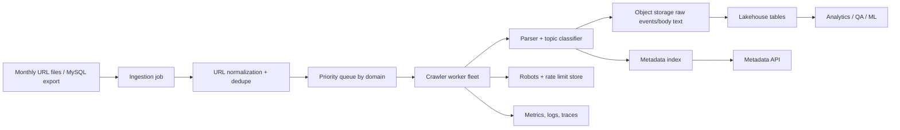

# Billion URL Collection Design

## Goals

Build a crawler platform that accepts monthly URL inputs, extracts metadata and topics, stores normalized content, and serves millions of metadata reads with predictable cost and high availability.

The local code in this repository is the single-URL crawler/parser/classifier. In production it becomes a stateless worker behind queues and domain-aware rate limiters.

The canonical data model for manifests, URL identity, crawl attempts, raw objects, parsed documents, and operational events is defined in [schema.md](schema.md).

## Reference Architecture

## Cloud Mapping

AWS is a concrete option, with equivalent services available on GCP or Azure.

| Capability | AWS service | Notes |
| --- | --- | --- |
| Monthly input | S3 + Glue crawler, or DMS from MySQL | Supports text files and database input. |
| Deduplication | Spark on EMR/Glue or Athena CTAS | Normalize URL, remove exact duplicates, assign batch IDs. |
| Work queue | SQS sharded by domain priority | Enables retry, backpressure, and dead-letter queues. |
| Rate limits | DynamoDB / Redis | Domain token bucket plus robots.txt cache. |
| Workers | ECS/Fargate, EKS, or Batch | Stateless containers; autoscale on queue depth and latency. |
| Raw storage | S3 JSONL/Parquet + lifecycle policies | Cheapest durable system of record. |
| Query index | DynamoDB, OpenSearch, or Aurora | Choose by access pattern: exact URL lookup vs search/filter. |
| Analytics | Iceberg/Parquet + Athena/Trino | Efficient monthly/domain/page-type scans. |
| Observability | CloudWatch, OpenTelemetry, Prometheus/Grafana | Unified metrics, logs, traces, and alerts. |

Cloud-agnostic equivalent:

- Object storage for monthly input, raw content, parsed text, and immutable event logs.
- Batch compute or distributed data processing for very large input normalization and dedupe.
- Durable queues or streams for stage handoff, retries, and dead-letter handling.
- Key-value state for URL identity, host politeness state, task leases, idempotency keys, and current crawl state.
- Container orchestration for crawler and parser worker fleets.
- Columnar lakehouse tables for batch analytics, audit, quality reporting, and SLO measurement.
- Optional low-latency serving index for exact URL lookup, metadata API reads, and support/debug workflows.

## Crawl Flow

1. Ingest monthly URL lists from object storage or MySQL.
2. Normalize URLs: lowercase host, remove fragments, sort known tracking parameters, preserve semantic query parameters, validate scheme.
3. Deduplicate by normalized URL hash and optionally content hash after crawling.
4. Partition work by registered domain to enforce politeness and avoid hot domains starving the rest of the batch.
5. Fetch with bounded timeouts, response-size caps, redirect limits, and content-type checks.
6. Parse metadata, headings, schema.org JSON-LD, normalized body text, page type, and topics.
7. Persist immutable crawl events, then materialize serving indexes.
8. Retry transient failures with exponential backoff; send permanent failures to a dead-letter queue for sampling and analysis.

## Ingestion and Frontier

Every monthly input receives a durable `dataset_id` and manifest before rows are processed. File ingestion should store the object path, checksum, row count, source owner, and schema version. MySQL ingestion should read from a replica or consistent export so source production tables are not locked by crawler batch jobs.

The ingestion job emits accepted source records and rejected records separately. Rejections should be explicit and queryable, for example malformed URL, unsupported scheme, too long, blocked source, or empty row. Accepted records are normalized into `url_id = sha256(canonical_url)` and sent to the frontier with an idempotency key based on `dataset_id + source_record_id + url_id`.

The frontier makes the first operational decision:

- `enqueue`: URL is eligible and should become a crawl task.
- `dedupe_skip`: URL was already present in the same dataset or is already fresh enough.
- `defer`: URL is valid but blocked by retry window, host circuit breaker, or capacity policy.
- `policy_skip`: URL is excluded by blocklist, robots, contract, content policy, or source governance.

This layer is where monthly batch requirements, recrawl freshness, per-source quotas, and customer priority are reconciled before the expensive network fetch stage.

## Queueing, Scheduling, and Backpressure

Avoid a single global FIFO queue. It creates head-of-line blocking when one host or source slows down. Use a two-stage model:

- Durable crawl-ready queues partitioned by priority, host shard, and crawl month.
- Host-aware schedulers that release work only when host tokens, robots rules, and global capacity allow.

Schedulers should maintain token buckets per host or registrable domain, plus global caps for worker fleet concurrency, bytes/sec, and storage writes. Queue messages use leases or visibility timeouts; if a worker dies, the task returns to the queue and is safe to retry because writes are idempotent.

Backpressure triggers:

- Oldest queue age exceeds the batch SLO.
- Parser queue grows faster than crawler completion.
- Object storage or metadata writes return elevated errors or throttling.
- DLQ rate rises for a source, domain, worker version, or parser version.
- Host-level 429/503, timeout, or connection-reset rates cross circuit-breaker thresholds.

Backpressure actions:

- Slow ingestion emission for low-priority datasets.
- Shift capacity to contractual or urgent priority buckets.
- Reduce host token refill rates.
- Pause parse-heavy content types when parser lag is the bottleneck.
- Stop acknowledging crawl tasks if durable result writes fail.

## Robots, Politeness, and Rate Limits

Robots and rate limits are part of dispatch, not post-fetch cleanup. The scheduler must check host policy before a URL reaches a worker.

Requirements:

- Cache robots.txt by scheme, host, and port with expiry and conditional refetch support.
- Respect disallow rules, crawl-delay when present, internal blocklists, and customer/domain overrides.
- Use bounded robots fetch retries. If robots cannot be fetched, default to conservative behavior unless an approved policy says otherwise.
- Keep an audit trail for every override, including owner, reason, scope, and expiration.
- Track per-host token wait time, robots disallow count, and politeness-related skips as first-class metrics.

## Parsing and Storage

Crawler workers should fetch and record network facts; parser workers should do CPU-heavy extraction. Decoupling these stages lets the system keep network throughput stable while scaling parsing independently.

Storage tiers:

- Raw content in object storage, compressed and keyed by crawl month plus URL hash prefix.
- Crawl attempts and parser outputs in append-only columnar tables for audit and analytics.
- Hot current state in a key-value or relational store for scheduling and support lookup.
- Optional OpenSearch-style index for interactive metadata search, not as the system of record.

Partition data by crawl month, status/terminal state, priority bucket, and URL or host hash prefix. Do not partition only by month; a single monthly billion-URL partition will be too large to manage or query efficiently.

## Scale and Cost Controls

At billion-URL scale, domain-aware throttling is the main control plane. A naive fleet can create unnecessary retries, blocks, and cloud spend. The scheduler should maintain per-domain token buckets and feed workers only when a domain has budget. Queue shards prevent a small number of large domains from dominating throughput.

Workers should cap body bytes, skip non-HTML content unless explicitly requested, compress outputs, and store full body text in object storage while keeping the low-latency index lean. Raw HTML retention can be short; parsed metadata and hashes are the durable product.

Autoscaling should use queue age, queue depth, crawl success rate, p95 fetch latency, and CPU/network utilization. Cost optimization levers include spot capacity for retryable batch work, reserved capacity for baseline workers, compression, object lifecycle policies, and choosing lakehouse queries over always-on databases for batch analytics.

Additional cost controls:

- Use lifecycle policies for raw HTML: hot recent data, warm monthly data, cold archive, and deletion after retention.
- Compact small Parquet/Iceberg files so analytics costs do not balloon over time.
- Store complete raw bodies only for useful content types and configured retention classes.
- Sample low-value failure bodies while recording metadata for every failed URL.
- Keep high-cardinality labels such as full URL out of metrics; put them in logs or trace samples.

## Reliability and Availability

The system should be at-least-once for crawl attempts and exactly-once for final materialized metadata per `batch_id + normalized_url_hash`. Idempotent writes prevent retries from duplicating records.

Use multi-AZ queues, worker clusters, and indexes. Store the canonical event log in object storage with versioning enabled. The metadata API can serve stale data during a new crawl month if batch processing is delayed.

Reliability patterns:

- Durable ingestion checkpoints for text files and MySQL snapshots.
- Task leases with heartbeat/visibility extension for long fetches.
- Retry queues separated by delay tier and reason.
- DLQs with replay manifests and operator audit.
- Graceful worker drain on deploy so in-flight tasks either finish or release their lease.
- Parser versioning so raw content can be reprocessed after extractor bugs.
- Regional pause mode that preserves queue state and prevents uncontrolled retry storms during upstream network or storage incidents.

## SLOs and SLAs

| Area | SLO |
| --- | --- |
| Single URL API availability | 99.9% monthly. |
| Single URL API latency | p95 under 2.5s for pages under 1 MB, excluding remote-origin slowness. |
| Monthly ingestion | 99% of accepted input records normalized and frontier-evaluated within 24 hours of source availability. |
| Monthly batch completion | 95% of eligible crawlable URLs reach terminal crawl state within 7 days and 99% within 14 days at planned capacity, excluding invalid, robots-disallowed, and policy-skipped URLs. |
| Parse completion | 99% of successfully fetched HTML pages parsed within 24 hours of fetch completion. |
| Metadata durability | 99.99% of terminal crawl results durably written before task acknowledgement, backed by object storage durability targets. |
| Parser correctness | 99% of sampled HTML pages extract title and canonical/meta fields when present. |
| Data freshness | Materialized metadata index updated within 15 minutes of successful crawl event. |
| Politeness compliance | 100% of dispatched fetches pass robots and configured host-rate-limit checks before network request. |

The external SLA offered to customers should be slightly lower than internal SLOs, for example 99.5% API availability and a documented 14-day delivery window for eligible monthly batch URLs. This leaves error budget for maintenance, source outages, origin slowness, and incident recovery.

Error-budget policy:

- If monthly crawl completion burns more than 50% of its error budget in the first week, pause non-critical crawler releases and focus on capacity or failure-rate reduction.
- If politeness violations are detected, pause affected hosts immediately and require incident review before resuming.
- If high-priority DLQ age exceeds 48 hours, page the owning team.

## Monitoring

Key metrics:

- Ingestion: URLs received, valid/invalid URL rate, dedupe ratio, batch lag.
- Scheduler: queue depth, oldest message age, per-domain throttle wait, DLQ volume.
- Fetch: status-code distribution, DNS/connect/TLS/timeout errors, redirect count, bytes downloaded, robots exclusions.
- Parser: title/description extraction rate, JSON-LD parse failures, body word-count distribution.
- Classifier: topic coverage, low-confidence rate, drift by domain/category.
- Storage: write errors, object bytes/day, index write throttle, query latency.
- API: request rate, p50/p95/p99 latency, error rate, saturation.

Operational tooling should include dashboards per batch and per domain, trace sampling for slow crawls, structured logs keyed by `crawl_id`, and alerts on SLO burn rate rather than only static thresholds.

Recommended dashboards:

- Batch coverage: submitted, accepted, rejected, deduped, queued, crawled, skipped, failed, parsed.
- Queue health: depth, oldest message age, retry rate, lease expiry rate, DLQ age.
- Politeness health: robots fetch failures, robots disallows, host token wait, 429/503 rate, open circuit breakers.
- Worker health: fetch latency percentiles, error classes, bytes downloaded, CPU, memory, network saturation.
- Parser quality: parse throughput, failure rate by parser version, missing title/description/canonical rates, duplicate content rate.
- Cost health: compute hours, storage growth, raw bytes/day, query spend, compaction lag.

Minimum runbooks:

- Ingestion stuck: inspect source availability, manifest checksums, checkpoints, schema drift, and queue write errors.
- Queue aging: check scheduler health, worker capacity, host token wait, storage latency, and priority starvation.
- Host 429 spike: reduce token refill, confirm user agent and robots changes, and contact the site owner when appropriate.
- Parser backlog: scale parser workers, check parser-version failure rate, and temporarily reduce parse-heavy crawl priority.
- DLQ replay: classify root cause, patch or tune policy, create replay manifest, replay through a low-priority lane, and monitor duplicate writes.
