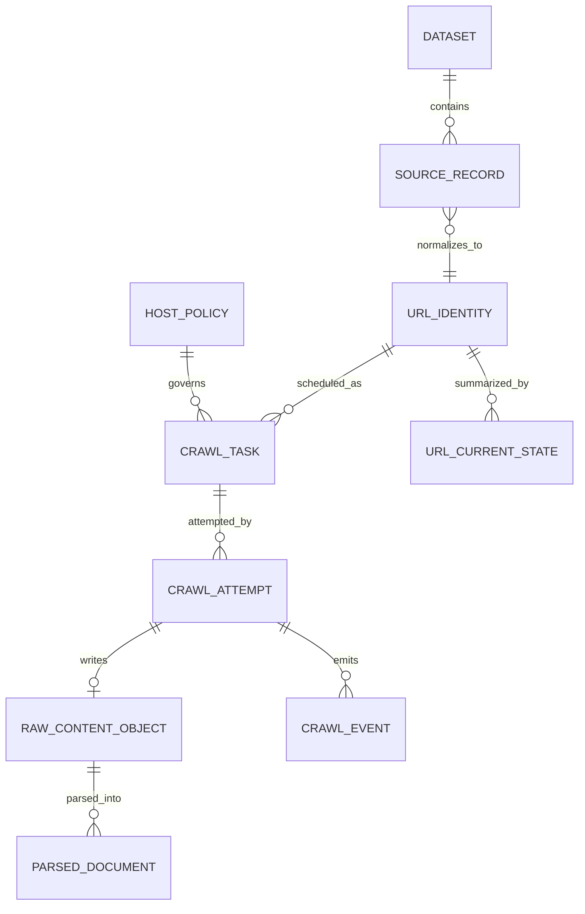

# Unified Crawl Data Schema

## Purpose

This document defines a unified schema for monthly URL ingestion, crawl execution, raw content storage, parsed content, and operational audit data. It is intentionally implementation-neutral: the same logical model can be implemented with relational tables, DynamoDB-style key-value tables, or lakehouse tables such as Parquet/Iceberg on object storage.

The schema supports:

- Text file and MySQL URL inputs.
- Idempotent ingestion and crawl processing.
- URL-level lineage from source record to terminal crawl state.
- Multiple crawl attempts per URL.
- Raw content and parsed content under one queryable model.
- Robots, rate-limit, dedupe, retry, and observability workflows.

## Design Principles

- Separate identity from events. A URL has stable identity records; crawls and parses are append-only events.
- Preserve original input. Keep raw submitted URLs and source metadata even when normalization changes.
- Make terminal states explicit. Invalid, duplicate, robots-disallowed, skipped, fetched, failed, and parsed are different states.
- Prefer append-only historical datasets for auditability, with compacted current-state views for operational queries.
- Use hashes for partitioning and joins, but keep canonical URLs available in controlled datasets.
- Version crawler, parser, schema, and normalization behavior on every derived record.

## Identifiers

| Identifier | Definition |
| --- | --- |
| `dataset_id` | Monthly source submission or database snapshot batch. |
| `source_record_id` | Stable row/file-line identifier within a dataset. |
| `url_id` | Stable identifier for canonical URL, usually `sha256(canonical_url)`. |
| `url_hash_prefix` | First N hex characters of `url_id`, used for partitioning. |
| `host_id` | Stable identifier for scheme + host + port or registrable host, depending on rate-limit scope. |
| `task_id` | Unique crawl task emitted by the frontier. |
| `attempt_id` | Unique crawl attempt for a task. |
| `raw_object_id` | Object-store pointer/version for raw response bytes. |
| `parse_id` | Unique parser output for one raw object and parser version. |

Recommended hash algorithm: SHA-256. Store the full hash and a short prefix for partition pruning.

## Logical Entities



## Core Tables

### `dataset_manifest`

One record per monthly file submission or MySQL snapshot.

| Column | Type | Notes |
| --- | --- | --- |
| `dataset_id` | string | Primary key. Suggested format: `yyyy_mm_source_sequence`. |
| `source_type` | enum | `text_file`, `mysql`, `api`, `manual_replay`. |
| `source_name` | string | Human-readable source owner/system. |
| `source_uri` | string | S3/object path, database/table name, or snapshot reference. |
| `crawl_month` | date | First day of represented month. |
| `received_at` | timestamp | When source became available. |
| `ingestion_started_at` | timestamp | Nullable until started. |
| `ingestion_completed_at` | timestamp | Nullable until completed. |
| `status` | enum | `received`, `ingesting`, `completed`, `failed`, `paused`, `cancelled`. |
| `input_record_count` | bigint | Count from manifest or source scan. |
| `accepted_record_count` | bigint | Valid records emitted to frontier. |
| `rejected_record_count` | bigint | Invalid records with rejection reasons. |
| `duplicate_record_count` | bigint | Input-level duplicates. |
| `checksum` | string | File checksum or snapshot checksum where available. |
| `schema_version` | string | Input schema/contract version. |
| `created_by` | string | Service or operator. |
| `metadata_json` | json | Source-specific attributes. |

Partitioning:

- Lakehouse: `crawl_month`, `source_type`, `source_name`.
- Relational: index `status`, `crawl_month`, `source_name`.

### `source_record`

Immutable record of every source row or file line that was accepted or rejected.

| Column | Type | Notes |
| --- | --- | --- |
| `dataset_id` | string | Composite primary key with `source_record_id`. |
| `source_record_id` | string | File line number, database primary key, or generated row ID. |
| `raw_url` | string | Original submitted URL before normalization. |
| `source_priority` | int | Optional source-provided priority. |
| `source_metadata_json` | json | Customer, region, tags, and other fields. |
| `validation_status` | enum | `accepted`, `rejected`. |
| `rejection_reason` | enum | Nullable; examples: `empty`, `bad_scheme`, `malformed_url`, `too_long`, `blocked_source`. |
| `url_id` | string | Nullable when rejected before normalization. |
| `canonical_url` | string | Nullable when rejected. |
| `created_at` | timestamp | Ingestion timestamp. |

Partitioning:

- Lakehouse: `dataset_id`, `validation_status`, `url_hash_prefix`.
- Use bucketing/hash partitioning for very large datasets to avoid one huge `dataset_id` partition.

### `url_identity`

Canonical URL identity and normalization lineage.

| Column | Type | Notes |
| --- | --- | --- |
| `url_id` | string | Primary key, `sha256(canonical_url)`. |
| `canonical_url` | string | Normalized URL used for dedupe. |
| `canonical_url_hash_prefix` | string | Short prefix for partitioning. |
| `scheme` | string | `http` or `https` for crawlable URLs. |
| `host` | string | Lowercase host. |
| `port` | int | Explicit or default. |
| `path` | string | Normalized path. |
| `query` | string | Normalized query string. |
| `registrable_domain` | string | eTLD+1 where available. |
| `host_id` | string | Rate-limit/policy scope key. |
| `normalization_version` | string | URL normalization code version. |
| `first_seen_at` | timestamp | First accepted source occurrence. |
| `last_seen_at` | timestamp | Most recent source occurrence. |

Partitioning:

- Key-value store: primary key `url_id`.
- Lakehouse: `canonical_url_hash_prefix`, optionally `registrable_domain`.

### `frontier_decision`

Append-only record explaining how the frontier handled an accepted URL candidate.

| Column | Type | Notes |
| --- | --- | --- |
| `decision_id` | string | Unique decision event ID. |
| `dataset_id` | string | Source dataset. |
| `source_record_id` | string | Source lineage. |
| `url_id` | string | Canonical URL. |
| `decision` | enum | `enqueue`, `dedupe_skip`, `defer`, `policy_skip`, `already_fresh`, `invalid_after_policy`. |
| `reason` | string | Human-readable detail or machine reason code. |
| `priority_bucket` | enum | `urgent`, `contractual`, `baseline`, `retry`, `low`. |
| `next_eligible_at` | timestamp | Used for defer/retry decisions. |
| `created_at` | timestamp | Decision time. |
| `frontier_version` | string | Frontier logic version. |

Partitioning:

- `crawl_month`, `decision`, `priority_bucket`.
- Index `url_id` for lineage lookup.

### `crawl_task`

Durable work item emitted by the frontier.

| Column | Type | Notes |
| --- | --- | --- |
| `task_id` | string | Primary key. |
| `url_id` | string | Canonical URL to crawl. |
| `dataset_id` | string | Dataset that caused this task. |
| `priority_bucket` | enum | Scheduling priority. |
| `crawl_month` | date | Monthly processing period. |
| `host_id` | string | Scheduler grouping key. |
| `queue_partition` | string | Priority and host shard partition. |
| `status` | enum | `queued`, `leased`, `completed`, `failed`, `skipped`, `dead_lettered`, `cancelled`. |
| `attempt_count` | int | Number of attempts created. |
| `max_attempts` | int | Retry budget. |
| `not_before` | timestamp | Earliest dispatch time. |
| `leased_until` | timestamp | Nullable active lease expiry. |
| `created_at` | timestamp | Task creation time. |
| `updated_at` | timestamp | Last task state update. |
| `idempotency_key` | string | Prevents duplicate task creation. |

Partitioning:

- Operational store: primary key `task_id`; secondary indexes on `status + priority_bucket + not_before`, `url_id`, and `host_id`.
- Lakehouse: `crawl_month`, `status`, `priority_bucket`, `url_hash_prefix`.

### `crawl_attempt`

One row per network fetch attempt.

| Column | Type | Notes |
| --- | --- | --- |
| `attempt_id` | string | Primary key. |
| `task_id` | string | Parent task. |
| `url_id` | string | URL identity. |
| `attempt_number` | int | Starts at 1. |
| `worker_id` | string | Crawler worker instance. |
| `scheduler_id` | string | Scheduler that released the task. |
| `started_at` | timestamp | Fetch start. |
| `completed_at` | timestamp | Fetch completion. |
| `terminal_state` | enum | `success`, `retryable_failure`, `permanent_failure`, `skipped`. |
| `error_class` | enum | Nullable; examples: `dns`, `connect_timeout`, `tls`, `robots_disallow`, `http_4xx`, `http_5xx`, `body_too_large`. |
| `requested_url` | string | URL actually requested. |
| `final_url` | string | Final URL after redirects. |
| `redirect_count` | int | Number of redirects followed. |
| `http_status` | int | Nullable for network failures. |
| `content_type` | string | Response header value, normalized where possible. |
| `content_length_bytes` | bigint | Header value or downloaded bytes. |
| `downloaded_bytes` | bigint | Actual bytes captured. |
| `dns_ms` | int | Nullable timing. |
| `connect_ms` | int | Nullable timing. |
| `tls_ms` | int | Nullable timing. |
| `ttfb_ms` | int | Nullable timing. |
| `total_fetch_ms` | int | End-to-end attempt duration. |
| `raw_object_id` | string | Nullable for skipped/failed attempts. |
| `crawler_version` | string | Fetcher code version. |
| `user_agent` | string | User agent used. |

Partitioning:

- Lakehouse: `crawl_month`, `terminal_state`, `http_status_class`, `host_hash_prefix`.
- Index `task_id`, `url_id`, `attempt_id`, and `started_at`.

### `raw_content_object`

Metadata for raw response bytes in object storage.

| Column | Type | Notes |
| --- | --- | --- |
| `raw_object_id` | string | Primary key. |
| `attempt_id` | string | Fetch attempt that wrote the object. |
| `url_id` | string | URL identity. |
| `object_uri` | string | Object-store path. |
| `object_version` | string | Storage version ID if available. |
| `compression` | enum | `none`, `gzip`, `zstd`. |
| `content_sha256` | string | Hash of stored bytes after decompression or defined policy. |
| `body_bytes` | bigint | Uncompressed body size. |
| `stored_bytes` | bigint | Stored object size. |
| `retention_class` | enum | `hot`, `warm`, `cold`, `delete_after_parse`, `legal_hold`. |
| `created_at` | timestamp | Write time. |
| `expires_at` | timestamp | Nullable retention expiry. |
| `encryption_key_id` | string | Key alias or ID if applicable. |

Object key recommendation:

```text
s3://crawl-raw/{crawl_month}/hash_prefix={url_hash_prefix}/{url_id}/{attempt_id}.html.gz
```

Equivalent layouts can be used in any object store. Include hash prefixes to avoid hot partitions and support targeted deletion.

### `parsed_document`

Parser output for a raw object.

| Column | Type | Notes |
| --- | --- | --- |
| `parse_id` | string | Primary key. |
| `raw_object_id` | string | Source raw content object. |
| `attempt_id` | string | Fetch attempt lineage. |
| `url_id` | string | URL identity. |
| `parser_version` | string | Parser code/model version. |
| `schema_version` | string | Parsed document schema version. |
| `parsed_at` | timestamp | Parse completion time. |
| `parse_status` | enum | `success`, `partial`, `failed`, `skipped`. |
| `parse_error_class` | enum | Nullable. |
| `detected_language` | string | ISO code where detected. |
| `detected_charset` | string | Charset used to decode. |
| `title` | string | HTML title. |
| `meta_description` | string | Meta description. |
| `canonical_url` | string | Canonical tag value after normalization when valid. |
| `robots_meta` | string | Meta robots value. |
| `h1_text` | string | First or aggregated H1, depending on parser policy. |
| `text_object_uri` | string | Object path for extracted text if too large for row storage. |
| `text_char_count` | bigint | Extracted text length. |
| `outlink_count` | int | Number of extracted links. |
| `structured_data_count` | int | JSON-LD/microdata count. |
| `content_fingerprint` | string | Exact or near-duplicate fingerprint. |
| `quality_flags_json` | json | Thin content, soft 404 signal, encoding issue, etc. |

Partitioning:

- Lakehouse: `crawl_month`, `parse_status`, `parser_version`, `url_hash_prefix`.
- Search/debug index: `url_id`, `canonical_url`, `title`, `parsed_at`.

### `extracted_link`

Optional append-only table for links discovered during parsing.

| Column | Type | Notes |
| --- | --- | --- |
| `parse_id` | string | Parser output lineage. |
| `source_url_id` | string | Page where link was found. |
| `target_raw_url` | string | Link as found. |
| `target_url_id` | string | Nullable if normalization failed. |
| `target_canonical_url` | string | Normalized target URL. |
| `rel` | string | Link rel attribute. |
| `anchor_text` | string | Optional truncated anchor text. |
| `is_internal` | boolean | Based on registrable domain policy. |
| `created_at` | timestamp | Extraction time. |

Partitioning:

- `crawl_month`, `source_host_hash_prefix`.
- For graph workloads, consider specialized downstream storage instead of querying this table directly at full scale.

### `host_policy`

Current host-level robots, rate-limit, and override state.

| Column | Type | Notes |
| --- | --- | --- |
| `host_id` | string | Primary key. |
| `scheme` | string | Policy scope. |
| `host` | string | Policy scope. |
| `port` | int | Policy scope. |
| `robots_status` | enum | `allowed`, `disallowed`, `unavailable`, `parse_failed`, `unknown`. |
| `robots_fetched_at` | timestamp | Last fetch time. |
| `robots_expires_at` | timestamp | Cache expiry. |
| `crawl_delay_ms` | int | From robots or internal policy. |
| `max_concurrency` | int | Host-level concurrent fetch cap. |
| `token_refill_per_sec` | decimal | Host token bucket rate. |
| `circuit_state` | enum | `closed`, `half_open`, `open`. |
| `circuit_reason` | string | Nullable. |
| `override_policy_id` | string | Nullable governed override. |
| `updated_at` | timestamp | Last policy update. |

This table is hot operational state. Keep historical changes in `policy_audit_event`.

### `url_current_state`

Compacted view of the latest known URL state for operations and recrawl decisions.

| Column | Type | Notes |
| --- | --- | --- |
| `url_id` | string | Primary key. |
| `canonical_url` | string | Current canonical URL. |
| `host_id` | string | Host policy key. |
| `first_seen_at` | timestamp | Earliest source occurrence. |
| `last_seen_at` | timestamp | Most recent source occurrence. |
| `last_dataset_id` | string | Most recent source dataset. |
| `last_task_id` | string | Last crawl task. |
| `last_attempt_id` | string | Last fetch attempt. |
| `last_crawl_at` | timestamp | Last terminal attempt. |
| `last_success_at` | timestamp | Last successful fetch. |
| `last_http_status` | int | Nullable. |
| `last_terminal_state` | enum | Latest terminal state. |
| `last_error_class` | enum | Nullable. |
| `last_raw_object_id` | string | Nullable. |
| `last_parse_id` | string | Nullable. |
| `last_content_fingerprint` | string | Nullable. |
| `next_eligible_crawl_at` | timestamp | Recrawl scheduler input. |
| `freshness_bucket` | enum | `fresh`, `stale`, `expired`, `unknown`. |
| `updated_at` | timestamp | View update time. |

Use this as an operational projection, not the audit source of truth.

### `crawl_event`

Structured event log for diagnostics, lineage, and incident review.

| Column | Type | Notes |
| --- | --- | --- |
| `event_id` | string | Primary key. |
| `event_type` | enum | `ingestion`, `frontier`, `scheduler`, `crawler`, `parser`, `storage`, `policy`, `dlq`. |
| `severity` | enum | `debug`, `info`, `warn`, `error`, `critical`. |
| `dataset_id` | string | Nullable. |
| `task_id` | string | Nullable. |
| `attempt_id` | string | Nullable. |
| `url_id` | string | Nullable. |
| `host_id` | string | Nullable. |
| `message` | string | Short machine-readable message. |
| `details_json` | json | Structured details. |
| `created_at` | timestamp | Event time. |

Partitioning:

- `event_date`, `event_type`, `severity`.
- Keep retention shorter than core audit tables unless compliance requires otherwise.

## State Machines

### Source record

```text
received -> accepted -> frontier_evaluated
received -> rejected
```

### Crawl task

```text
queued -> leased -> completed
queued -> leased -> failed -> queued
queued -> leased -> failed -> dead_lettered
queued -> skipped
queued -> cancelled
```

### Crawl attempt

```text
started -> success
started -> retryable_failure
started -> permanent_failure
started -> skipped
```

### Parse

```text
queued -> success
queued -> partial
queued -> failed
queued -> skipped
```

## Enums

Recommended initial enum values:

`terminal_state`:

- `success`
- `retryable_failure`
- `permanent_failure`
- `skipped`

`error_class`:

- `none`
- `invalid_url`
- `robots_disallow`
- `blocked_by_policy`
- `dns_error`
- `connect_timeout`
- `read_timeout`
- `tls_error`
- `too_many_redirects`
- `http_4xx`
- `http_5xx`
- `http_429`
- `body_too_large`
- `unsupported_content_type`
- `storage_write_failed`
- `unknown`

`parse_error_class`:

- `none`
- `unsupported_content_type`
- `decode_failed`
- `malformed_html`
- `parser_timeout`
- `extractor_failed`
- `raw_object_missing`
- `unknown`

## Partitioning Strategy

At billion-URL scale, partitioning is part of the schema contract.

Recommended partitions:

- Monthly lineage: `crawl_month`.
- Time-based operations: `event_date`, `created_date`, or `started_date`.
- Hash distribution: `url_hash_prefix`, `host_hash_prefix`.
- Query pruning: `status`, `terminal_state`, `priority_bucket`, `source_name`.

Avoid:

- Partitioning only by month; one monthly partition can become enormous.
- Partitioning by full host; this creates high-cardinality metadata and hot domains.
- Partitioning by full URL; this creates too many tiny partitions.
- Storing full response bodies in relational rows.

Suggested lakehouse layout:

```text
s3://crawl-data/dataset_manifest/crawl_month=2026-06/
s3://crawl-data/source_record/crawl_month=2026-06/dataset_id=.../bucket=00/
s3://crawl-data/crawl_attempt/crawl_month=2026-06/terminal_state=success/url_bucket=ab/
s3://crawl-data/parsed_document/crawl_month=2026-06/parser_version=v1/url_bucket=ab/
s3://crawl-data/crawl_event/event_date=2026-06-01/event_type=crawler/
```

Use compaction jobs to merge small files into target sizes appropriate for the query engine, commonly 128 MB to 1 GB per file depending on workload.

## Idempotency and Consistency

Idempotency keys:

- Source record: `dataset_id + source_record_id`.
- Frontier decision: `dataset_id + source_record_id + url_id + frontier_version`.
- Crawl task: `dataset_id + url_id + priority_bucket + crawl_month`.
- Crawl attempt: generated unique ID, but result commit should be guarded by `task_id + attempt_number`.
- Parse result: `raw_object_id + parser_version + schema_version`.

Consistency model:

- Ingestion and crawl queues are at-least-once.
- Result writes must happen before queue acknowledgement.
- Current-state tables are eventually consistent projections from append-only events.
- Duplicate attempts are acceptable if they converge to the same terminal task state and do not overwrite immutable raw objects.

## Data Retention

Recommended defaults:

| Data | Retention |
| --- | --- |
| Dataset manifests | Indefinite or contract-defined. |
| Source records | 13 to 25 months, depending on audit needs. |
| Crawl attempts | 13 to 25 months online; archive after. |
| Raw HTML content | 30 to 180 days hot/warm unless product requires longer. |
| Parsed content | 13 to 25 months for trend analysis. |
| Crawl events/logs | 30 to 90 days hot, archive critical/audit events longer. |
| Host policy history | 13 months minimum for incident review. |

Apply deletion by dataset, source owner, URL hash, or object retention class. Keep raw object references and deletion tombstones so downstream consumers can distinguish "not fetched" from "deleted by retention."

## Example Queries

Monthly coverage by terminal state:

```sql
SELECT
  crawl_month,
  terminal_state,
  COUNT(*) AS attempts
FROM crawl_attempt
WHERE crawl_month = DATE '2026-06-01'
GROUP BY crawl_month, terminal_state;
```

Oldest high-priority queued tasks:

```sql
SELECT task_id, url_id, priority_bucket, created_at, not_before
FROM crawl_task
WHERE status = 'queued'
  AND priority_bucket IN ('urgent', 'contractual')
ORDER BY created_at
LIMIT 100;
```

Parser completeness:

```sql
SELECT
  parser_version,
  COUNT(*) AS parsed_pages,
  SUM(CASE WHEN title IS NULL OR title = '' THEN 1 ELSE 0 END) AS missing_title,
  SUM(CASE WHEN meta_description IS NULL OR meta_description = '' THEN 1 ELSE 0 END) AS missing_description
FROM parsed_document
WHERE crawl_month = DATE '2026-06-01'
  AND parse_status = 'success'
GROUP BY parser_version;
```

## Schema Evolution

- Add columns with nullable/default semantics first.
- Version normalization, crawler, parser, and schema independently.
- Keep parsers able to read at least the previous raw object metadata version.
- Use compatibility tests for every producer/consumer pair.
- Backfill derived fields through append-only reprocessing jobs instead of mutating historical source records.
- Record migration jobs in `crawl_event` with operator/service identity and affected partitions.

## Minimum Viable Implementation

For an initial production-ready implementation:

- `dataset_manifest`
- `source_record`
- `url_identity`
- `frontier_decision`
- `crawl_task`
- `crawl_attempt`
- `raw_content_object`
- `parsed_document`
- `host_policy`
- `url_current_state`
- `crawl_event`

This gives the team enough structure to ingest monthly URL lists, crawl politely, audit outcomes, reprocess parser output, and measure SLOs without prematurely optimizing for every downstream analytics use case.
